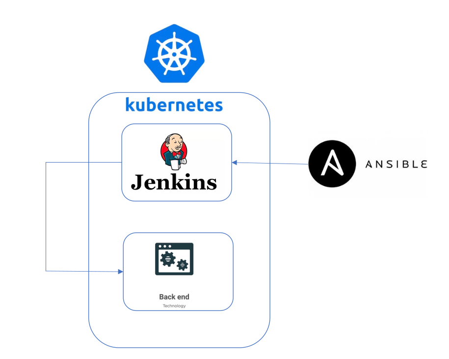
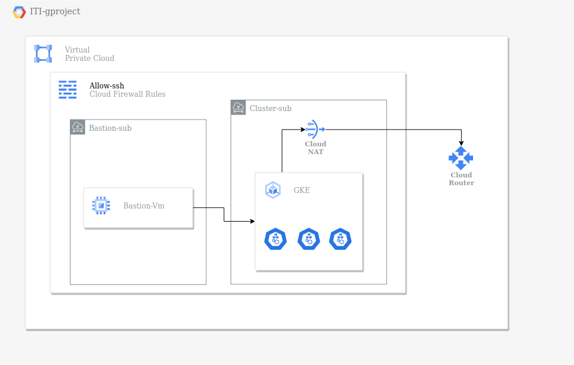
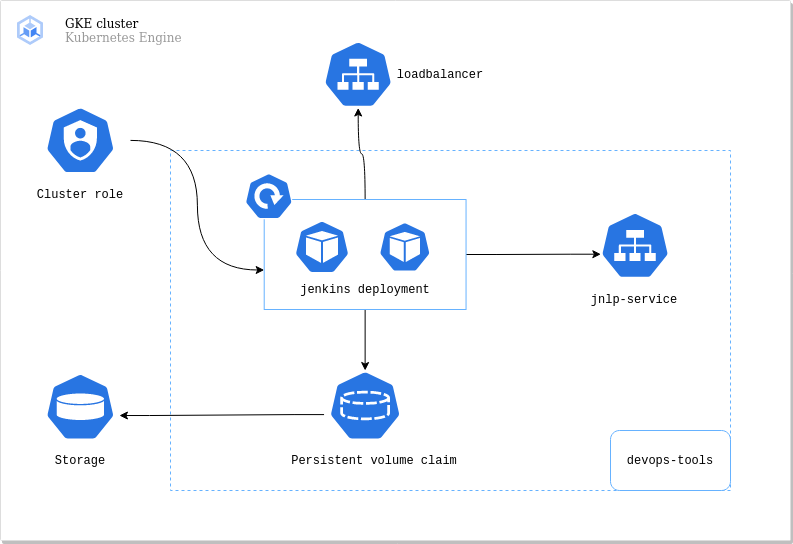

<h1 align="center">ITI-Graduation-Project</h1>

<h2 align="center">Infrastructure</h2>


## Requirements :

### 1. Create infrastructure on GCP

### 2. Configure bastion-vm with ansible

### 3. Customize jenkins image and create jenkins deployment

<p align="center">

</p>


## 1. Build infrastructure using Terraform

- Network components
- Firewalls
- Service accounts
- Bastion - vm
- GKE

```bash
Terraform apply
```



## 2. Configure bastion-vm

- apt update
- install gcloud sdk
- install kubectl

by ansible playbook :

```bash
ansible-playbook packages.yaml
```

## 3. Jenkins deployment

1. **Create custom image of jenkins with gcloud and kubectl** 

```docker
./jenkins_deployment/Dockerfile :

FROM jenkins/jenkins:lts
USER root
...
RUN apt-get install -y kubectl
...
RUN apt-get install google-cloud-sdk
...
RUN apt-get install google-cloud-sdk-gke-gcloud-auth-plugin
USER jenkins
```

1. **Build and push jenkins image to dockerhub :**

```bash
docker build . -t dockerhub/myimage:jenkinskube
docker push dockerhub/myimage:jenkinskube
```

## 4. C**reate jenkins deployment on the cluster :**

1. **Run ansible script**

```bash
ansible-playbook kubernetes.yaml
```

- Create namespace
- Create service account
- Create Persistent volume claim and storage class
- Create jenkins deployment
- Create load balancer service
- Create jenkins jnlp service

<p align="center">

</p>


2. **Check the volume is bound to jenkins deployment** 


<p align="center">

</p>


3. **Check deployment is running**
<p align="center">

</p>


4. **Get Loadbalancer External ip** 

<p align="center">

</p>


5. **Access jenkins server**

